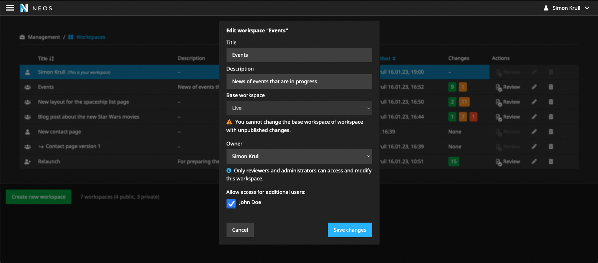

# An alternative workspace module with additional features for Neos CMS

This Neos CMS plugin provides an alternative workspace module with added features:

* New hierarchical workspace list
* New dialogs for creation, deletion and editing of workspaces
* Tracks and shows workspace creator, last editor and last publish date
* Can remove unpublished changes and rebase dependent workspaces on delete
* Share private workspaces with selected users

## Screenshots

### Module overview 
An overview with all available workspaces. All changes in the respective workspaces are highlighted in color.


### Creation dialog
Create private or public workspaces. Set a base workspace where the changes from your created workspace will be published.


### Editing dialog
If you want to change something again, you can edit your workspace at any time.


### Shared workspaces
Private workspaces can now be shared with other users in the backend.



### Deletion dialog
Workspaces can be deleted at any time. Note: that unpublished changes in the workspace will be lost.


## Installation

Run

```console
composer require shel/neos-workspace-module
```

Then apply database migrations

```console
./flow doctrine:migrate
```

## Support

* Neos 5.3 - 8.x
* PostgreSQL & MySQL / MariaDB
                                
## Detailed feature list
                           
* New workspace list
  * Sort by title or last modification data
  * Group workspaces by their parent (base) workspaces
  * Tracks & displays user and date of last change in a workspace
  * Stores original creator of a workspace
* Optimised changes counts
  * Shows absolute number of changes instead of relation color bar
  * Async loading of changes counts in workspace overview
  * Shows disconnected nodes for workspace without valid changes
* New workspace deletion dialog
  * Allows preview of consequences and confirm
  * Force deletion of workspaces with unpublished changes and dependent workspaces
    * Will rebase dependent workspaces
* New workspace creation and editing dialog
  * New workspace will be created as public (internal) by default
  * Configurable workspace title validation
  * Select users to share a private workspace with

## Planned features

* Caching of changes counts
* Faster workspace review module

## License

See [License](LICENSE.txt)
